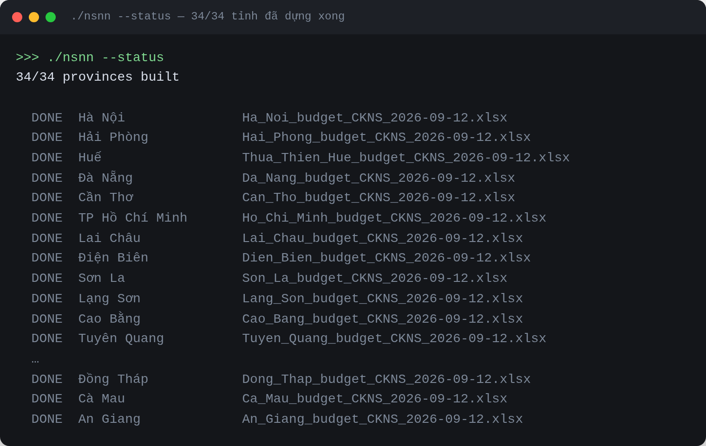
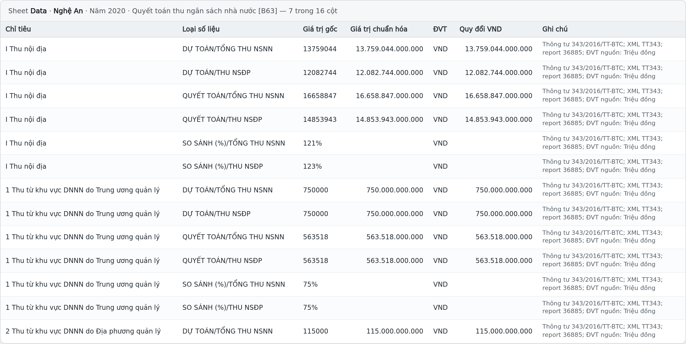
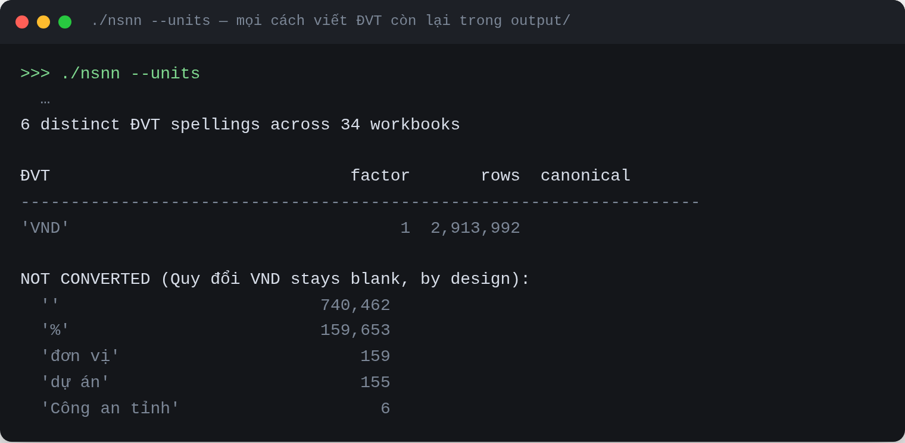
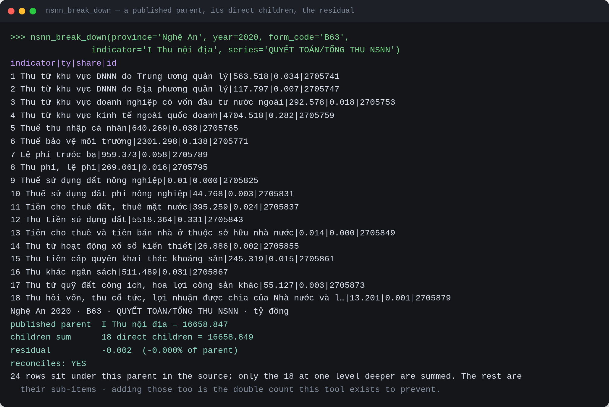
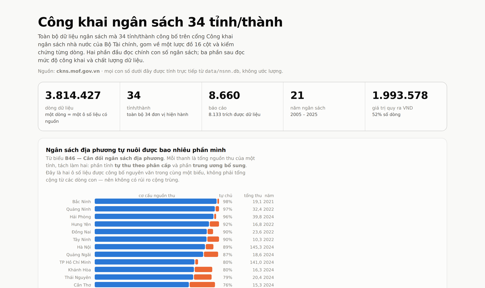
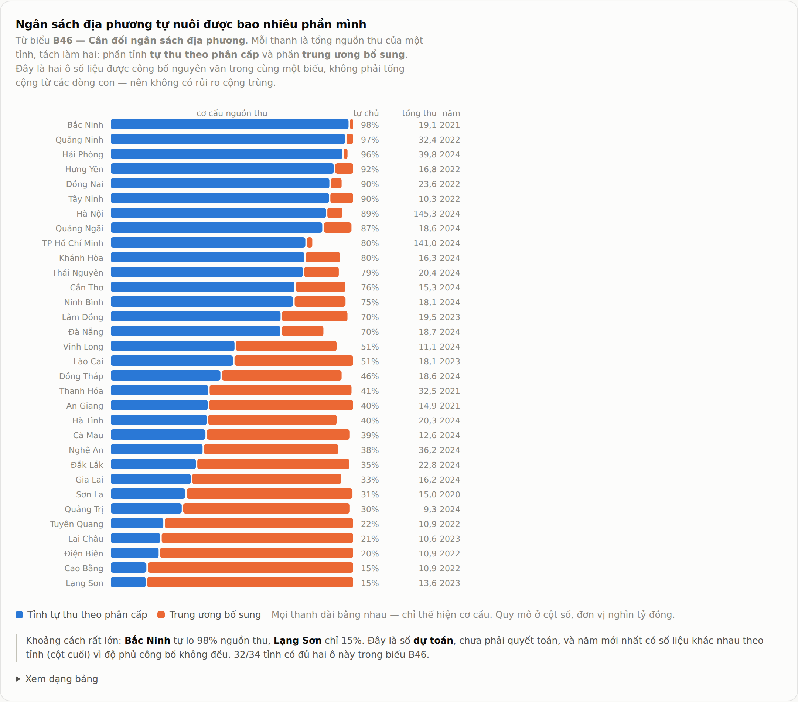
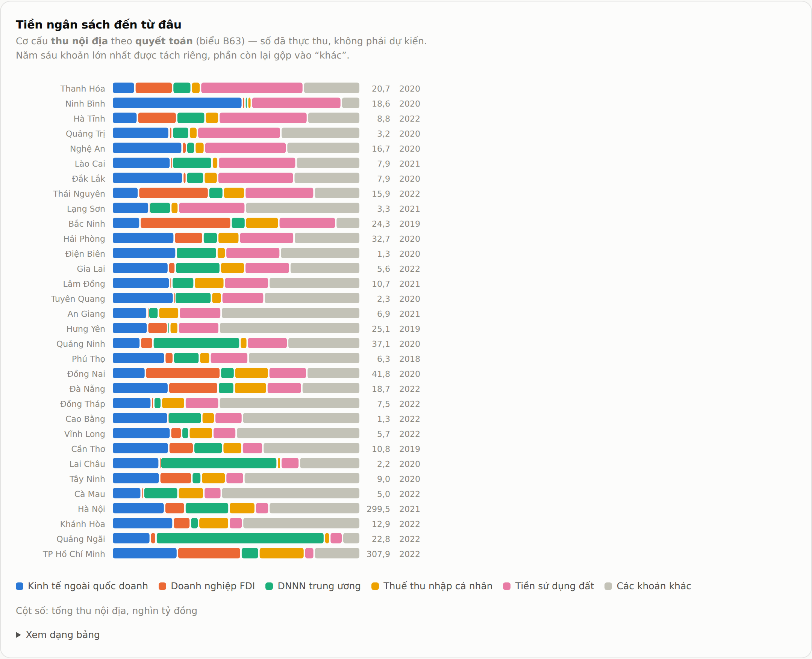
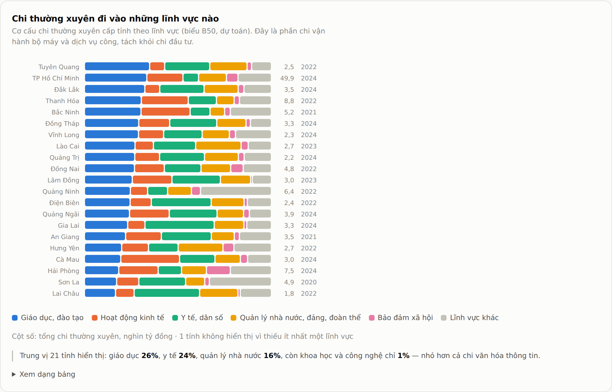
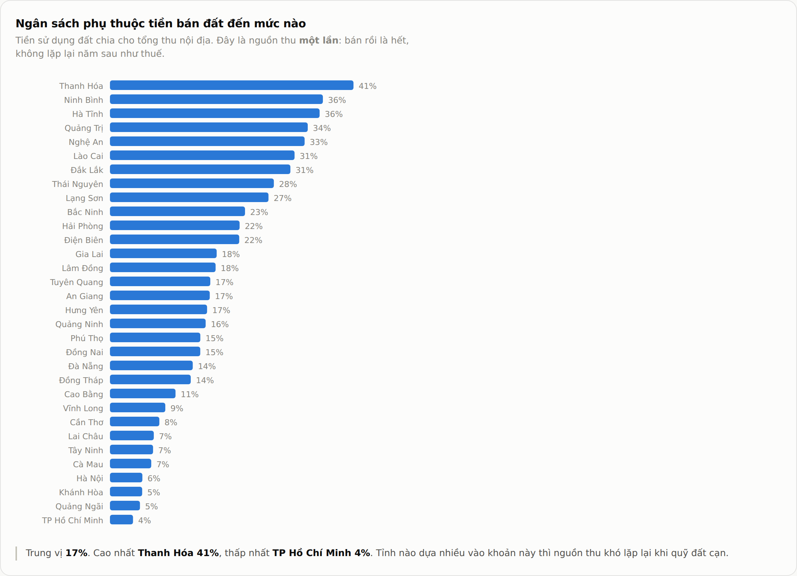
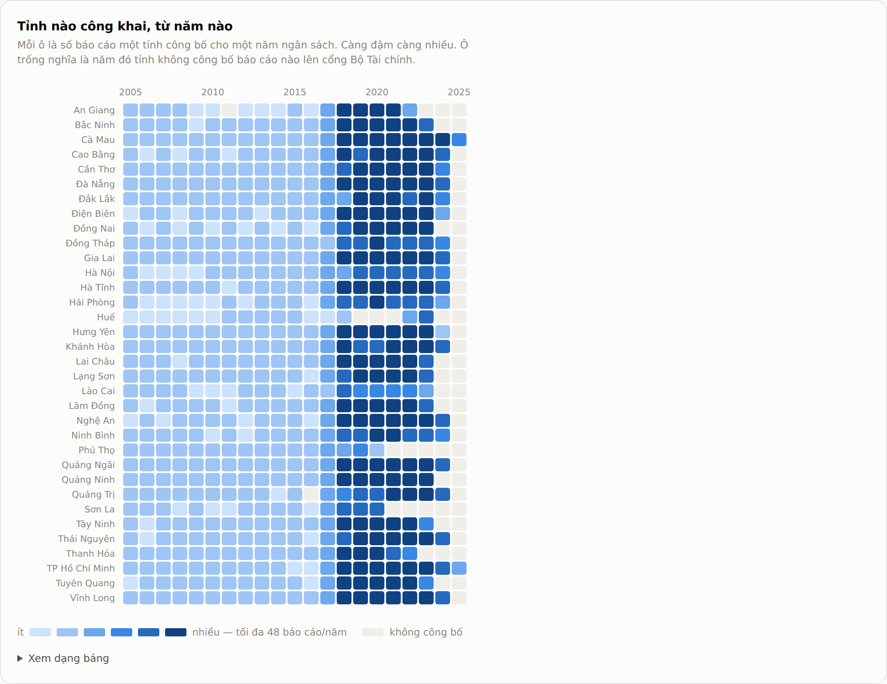

# Thu thập dữ liệu công khai ngân sách 34 tỉnh/thành Việt Nam

Công cụ tự động tải dữ liệu ngân sách mà các tỉnh đã công bố trên **Cổng công khai
ngân sách nhà nước của Bộ Tài chính** (`ckns.mof.gov.vn`), rồi xuất ra file Excel
theo một bộ 16 cột thống nhất.

Một tỉnh mất khoảng **1–3 phút** (đo được: Lào Cai 47s, Hưng Yên 70s, Cà Mau 190s).

Bạn **không cần biết lập trình**. Chỉ cần gõ đúng vài dòng lệnh.

---

## Cài đặt (chỉ làm 1 lần)

Mở ứng dụng **Terminal** trên máy Mac.
(Bấm `Cmd` + dấu cách, gõ chữ `Terminal`, bấm Enter.)

Copy từng dòng dưới đây, dán vào Terminal, bấm Enter sau mỗi dòng:

```bash
git clone https://github.com/xuanhaihust/nsnn-budget-crawler.git
cd nsnn-budget-crawler
python3 -m venv .venv && .venv/bin/pip install -r requirements.txt
```

Xong phần cài đặt. Từ giờ chỉ cần dùng lệnh ở mục dưới.

---

## Cách dùng

Vào thư mục dự án rồi chạy:

```bash
cd nsnn-budget-crawler
./nsnn
```

Máy sẽ tự chạy cả 34 tỉnh, mỗi lần 5 tỉnh cùng lúc.

Trong lúc chạy, màn hình hiện từng tỉnh khi xong:

```
[3/34] OK    Bắc Ninh    108862 rows | 262/292 reports | 307s
```

Kết quả nằm trong thư mục `output`. Mỗi tỉnh là một file Excel.

### Các lệnh khác

| Bạn muốn | Gõ lệnh |
|---|---|
| Chạy tất cả 34 tỉnh | `./nsnn` |
| Chỉ chạy vài tỉnh | `./nsnn "Bắc Ninh" "Hưng Yên"` |
| Xem tỉnh nào đã xong, tỉnh nào chưa | `./nsnn --status` |
| Máy chạy chậm, muốn nhẹ hơn | `./nsnn --jobs 3` |
| Xem danh sách tên tỉnh đúng | `./nsnn --list` |

Tên tỉnh phải bỏ trong dấu ngoặc kép `" "` và viết có dấu.

Nếu lỡ tắt giữa chừng thì chạy lại lệnh cũ. Phần đã tải xong không tải lại,
nên lần sau rất nhanh.

Gõ `./nsnn --status` để xem đã xong tới đâu:



---

## File kết quả có gì

Mỗi file Excel có 3 sheet:

| Sheet | Nội dung |
|---|---|
| **Data** | Dữ liệu chính, 16 cột |
| **Summary_QA** | Tổng hợp: lấy được bao nhiêu báo cáo, bao nhiêu dòng, loại trùng bao nhiêu |
| **Pending_Review** | Các báo cáo chưa đọc được và lý do |

16 cột: Tỉnh/TP hiện hành · Tỉnh/TP theo nguồn · Số QĐ/Văn bản · Ngày tài liệu ·
Kỳ dữ liệu · Cơ quan · Phạm vi · Nội dung/Bảng · Chỉ tiêu · Loại số liệu ·
Giá trị gốc · Giá trị chuẩn hóa · ĐVT · Quy đổi VND · Nguồn · Ghi chú.

Sheet `Data` trông như thế này — đây là số liệu thật của Nghệ An, biểu B63 năm 2020:



Để ý các dòng `SO SÁNH (%)`: giá trị gốc là `121%`, `75%`, nên cột `Quy đổi VND` **để trống** —
không biết chắc là tiền thì không quy đổi.

Cột `ĐVT` ở những dòng đó vẫn ghi `VND`, vì đơn vị được khai ở **đầu bảng** chứ không khai
riêng cho từng cột. Đây là một điểm chưa đúng đã biết, xem mục *Hạn chế đã biết* ở cuối.

**Về cột `ĐVT` và `Giá trị chuẩn hóa`.** Các tỉnh viết đơn vị rất khác nhau — `Triệu đồng`,
`đồng`, `tỷ đồng`, `1.000.000 đồng`, thậm chí sai chính tả như `Tr đồng`, `Tiệu đồng`. Nhưng
tất cả đều là **một loại tiền, chỉ khác thang đo**. Vì vậy:

- Cột `ĐVT` ghi **`VND`** cho mọi dòng tiền — một đơn vị duy nhất, không còn 4 thang.
- Cột `Giá trị chuẩn hóa` là **số tiền đã quy về VND**, so sánh được ngay giữa các tỉnh.
- Cột `Giá trị gốc` vẫn giữ **nguyên văn** con số tỉnh đã công bố (ví dụ `6193000`).
- Cột `Ghi chú` ghi `ĐVT nguồn: Triệu đồng` — thang đo tỉnh đã dùng.

Nghĩa là không mất gì: muốn trích dẫn đúng như tỉnh công bố thì xem `Giá trị gốc` +
`Ghi chú`; muốn tính toán so sánh thì dùng `Giá trị chuẩn hóa`.

Chuỗi nào không chắc chắn là đơn vị tiền (`%`, `dự án`, `đơn vị`…) thì để nguyên và **không**
quy đổi.

Muốn xem toàn bộ cách viết đơn vị đang có trong file kết quả: gõ `./nsnn --units`.



Năm dòng dưới mục *NOT CONVERTED* là đúng như thiết kế: không phải đơn vị tiền thì không quy
đổi. Riêng `Công an tỉnh` là tên cơ quan lọt vào cột đơn vị — 6 dòng, không dòng nào có số,
và **để nguyên** thay vì đoán.

Kết quả thực tế đã chạy:

| Tỉnh | Số dòng |
|---|---|
| Bắc Ninh | 108.862 |
| Quảng Ninh | 95.829 |
| Hà Nội | 90.959 |
| Hưng Yên | 82.220 |
| Hải Phòng | 48.338 |

---

## Hỏi dữ liệu bằng trợ lý AI (tuỳ chọn)

Phần này dành cho ai muốn dùng Claude hoặc một trợ lý AI khác để **hỏi thẳng vào dữ liệu**
thay vì mở từng file Excel. Không bắt buộc — bỏ qua cũng không ảnh hưởng gì.

Toàn bộ 34 tỉnh đã được gộp sẵn vào một kho dữ liệu nén kèm trong dự án. Chạy hai dòng này
một lần duy nhất:

```bash
.venv/bin/python dashboard/db.py restore
.venv/bin/pip install -r mcp_server/requirements.txt
```

Xong. Nếu bạn mở dự án bằng **Claude Code**, các công cụ tra cứu tự xuất hiện, không cần làm
gì thêm. Bạn có thể hỏi những câu như *“tỉnh nào tự chủ ngân sách cao nhất”*, *“Nghệ An thu
từ đất bao nhiêu năm 2020”*, *“so sánh chi giáo dục giữa các tỉnh”*.

**Vì sao phải có công cụ riêng, không để AI tự viết truy vấn?** Vì biểu mẫu ngân sách có cấu
trúc lồng nhau: dòng tổng và các dòng chi tiết của nó nằm cạnh nhau trong bảng. Cộng tất cả
lại sẽ ra con số **gấp khoảng 6 lần** số mà chính tỉnh công bố — và không có gì báo hiệu điều
đó. Bộ công cụ này được viết để AI không rơi vào bẫy đó: nó chỉ đọc đúng ô đã công bố, hoặc
tách một dòng cha ra các dòng con rồi **báo rõ phần chênh lệch** để bạn tự thấy có khớp hay
không.

Nó cũng **không tự sửa số**. Chỗ nào dữ liệu nguồn có vấn đề, nó gắn cờ cảnh báo và giữ
nguyên con số như đã công bố.

Một ví dụ có thật: tách dòng tổng `I Thu nội địa` của Nghệ An năm 2020 ra các dòng con, rồi
**tự đối chiếu lại** với con số tỉnh đã công bố:



Dòng `reconciles: YES` là phần quan trọng: nó nói cho bạn biết bảng có khớp hay không, thay vì
đưa ra một con số rồi để bạn tin. Ở đây có 24 dòng nằm dưới dòng cha, nhưng chỉ 18 dòng con
trực tiếp được cộng — cộng cả 24 là đúng cái bẫy gấp 6 lần nói ở trên.

Chi tiết kỹ thuật: xem `mcp_server/README.md` và `docs/2026-09-13-mcp-server.md`.

---

## Xem nhanh bằng biểu đồ (tuỳ chọn)

Mở file `dashboard/index.html` bằng trình duyệt. Không cần cài gì thêm, không cần mạng —
mọi con số đã nằm sẵn trong file đó.



Trang này có **14 biểu đồ**: 10 biểu đồ đọc chính con số ngân sách, 4 biểu đồ đọc mức độ công
khai và chất lượng dữ liệu. Vài biểu đồ tiêu biểu:

**Tỉnh tự lo được bao nhiêu phần ngân sách của mình** — Bắc Ninh 98%, Lạng Sơn 15%:



**Tiền ngân sách đến từ đâu** — năm khoản thu lớn nhất của từng tỉnh:



**Chi thường xuyên đi vào đâu** — trung vị: giáo dục 26%, y tế 24%, khoa học công nghệ chỉ 1%:



**Ngân sách phụ thuộc tiền bán đất đến mức nào** — trung vị 17%, Thanh Hóa 41%:



**Tỉnh nào công khai, từ năm nào** — ô trống là năm tỉnh không công bố gì lên cổng Bộ Tài chính:



Xem đủ 14 biểu đồ kèm giải thích: `dashboard/README.md`.

---

## Nguyên tắc số liệu

Công cụ lấy đúng như nguồn công bố, **không tự suy đoán**:

- Ô trống ở nguồn thì để trống, **không tự điền số 0**.
- Nguồn ghi dấu `-` thì giữ nguyên dấu `-`.
- Báo cáo nào đọc không chắc chắn thì đưa vào sheet `Pending_Review`, không đoán bừa.
- Cột `Quy đổi VND` chỉ điền khi biết rõ đơn vị tính.
- Không thu thập cấp xã/phường.

---

## Phạm vi dữ liệu — đọc kỹ phần này

Công cụ này chỉ lấy **dữ liệu ngân sách tổng hợp cấp tỉnh** từ cổng của Bộ Tài chính.

Nó **chưa lấy** phần công khai ngân sách của từng Sở, ban, ngành đăng trên website
riêng của các tỉnh. Vì vậy **không được coi một tỉnh là đã hoàn thành** chỉ dựa vào
file do công cụ này sinh ra.

Thư mục `samples/` chứa dữ liệu mẫu lấy từ cổng thông tin các tỉnh, để đối chiếu.
Hai nguồn bổ sung cho nhau, không thay thế nhau.

---

## Hạn chế đã biết

**Đơn vị tính được khai ở đầu bảng, không khai cho từng cột.** Một biểu ghi
*"Đơn vị tính: Triệu đồng"* ở đầu, rồi bên trong có thêm cột `SO SÁNH (%)`. Công cụ gán đơn vị
của cả bảng cho mọi dòng, nên dòng phần trăm cũng mang `ĐVT = VND`.

- Phần lớn trường hợp **không sinh ra con số sai**: 34.232 dòng có giá trị gốc chứa dấu `%`
  đều mang `ĐVT = VND` nhưng **không dòng nào** có số ở cột `Quy đổi VND` — vì `121%` không
  đọc được thành số thì không quy đổi. (đã đếm trên `data/nsnn.db`)
- Nhưng khi cột phần trăm ghi số trần, ví dụ `216.87` thay vì `216.87%`, thì con số **bị nhân
  lên thành tiền**. Một ví dụ đã kiểm chứng: An Giang, biểu `66/CK-NSNN` năm 2020, cột
  `SO SÁNH (%) / TỔNG SỐ / CHI THƯỜNG XUYÊN`, giá trị gốc `216.87660624369599` ra
  `216.876.606 VND`.
- **Chưa đếm được tổng số dòng bị ảnh hưởng.** Không thể chỉ dựa vào tên cột có chữ `%`: cột
  `Trong đó: 90% NST` là tiền thật, còn cột `SO SÁNH ƯỚC THỰC HIỆN VỚI (%)` ở một số báo cáo
  lại chứa số tuyệt đối. Muốn đếm đúng phải xét từng biểu. **Chưa sửa** — sửa bằng cách đoán
  sẽ phạm đúng nguyên tắc "không tự suy đoán" ở trên.

Các hạn chế khác: khoảng 50 bản ghi mỗi truy vấn CKNS bị thiếu so với con số máy chủ tự báo;
527 báo cáo không rút được dòng nào, lý do ghi ở sheet `Pending_Review`; 757
giá trị lệch 100 lần trở lên so với chính lịch sử của ô đó, **được gắn cờ chứ không sửa**.

---

## Lưu ý

- **Đừng xoá hoặc sửa thư mục `samples`.** Đó là dữ liệu mẫu tham chiếu.
- Thư mục `work` chứa toàn bộ file gốc đã tải về (vài GB), dùng để đối chiếu khi
  cần kiểm tra một con số. Xoá được, nhưng lần chạy sau sẽ phải tải lại từ đầu.
- Công cụ chỉ đọc dữ liệu đã công khai, không đăng nhập, không gửi gì lên máy chủ.

---

## Nếu bị lỗi

| Thông báo | Cách xử lý |
|---|---|
| `command not found` | Bạn chưa vào đúng thư mục. Gõ lại `cd nsnn-budget-crawler`. |
| `province ... not found` | Sai tên tỉnh. Gõ `./nsnn --list` để xem tên đúng. |
| `No module named openpyxl` | Chưa cài đặt. Chạy lại dòng `python3 -m venv .venv && ...` ở mục Cài đặt. |
| Mạng lỗi giữa chừng | Chạy lại lệnh cũ, không mất dữ liệu đã tải. |

---

## Yêu cầu hệ thống

macOS hoặc Linux, Python 3.10 trở lên, khoảng 5 GB trống trên ổ đĩa nếu chạy đủ 34 tỉnh.

## Giấy phép

Mã nguồn: MIT (xem `LICENSE`). Dữ liệu ngân sách thuộc về các cơ quan nhà nước
đã công bố, không thuộc phạm vi giấy phép này.
