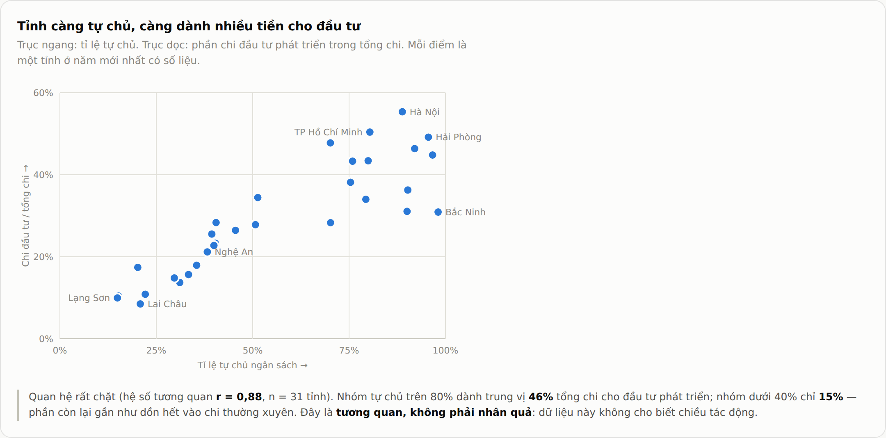
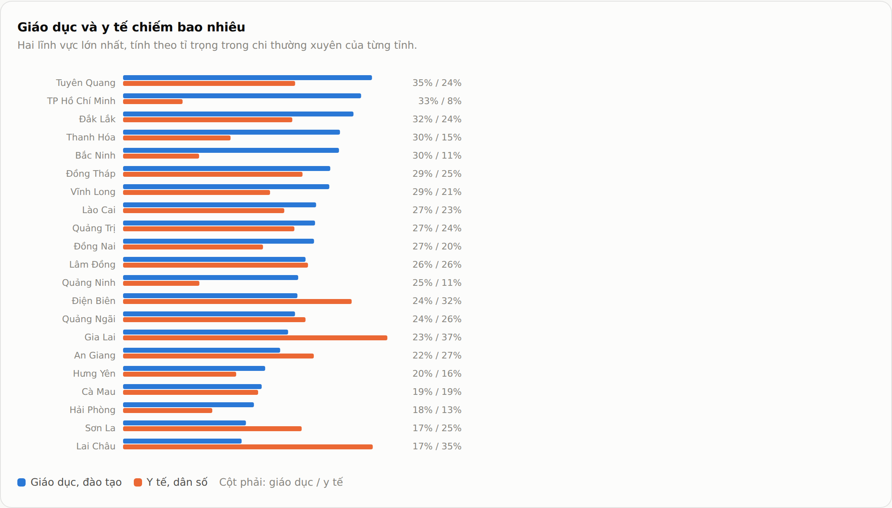
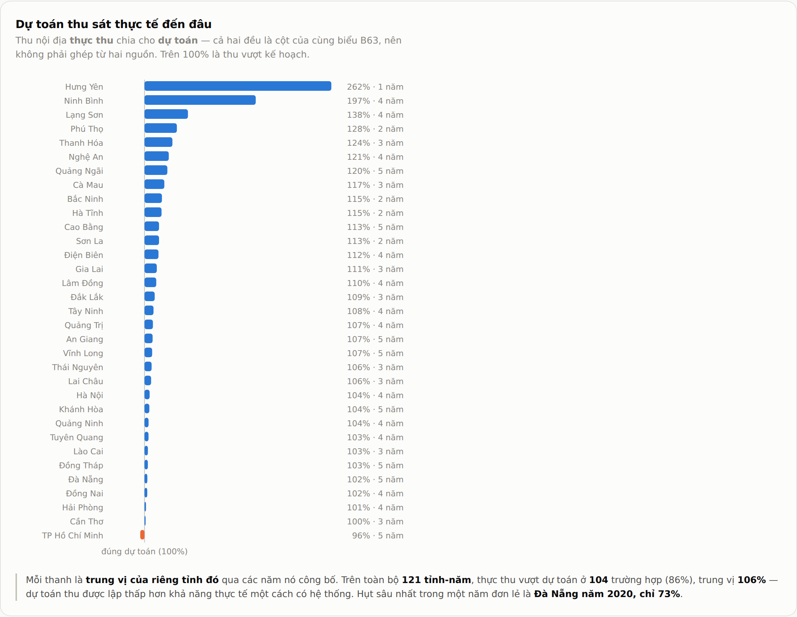
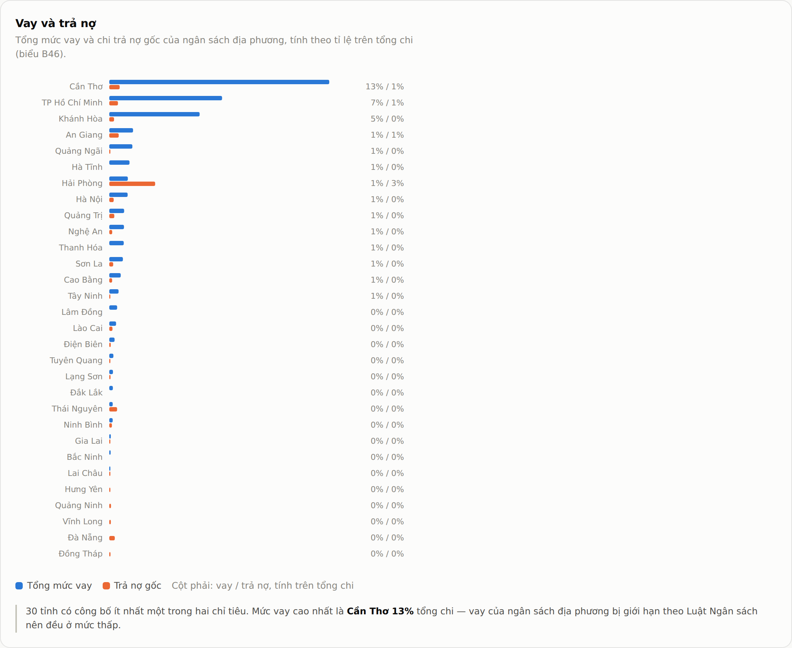
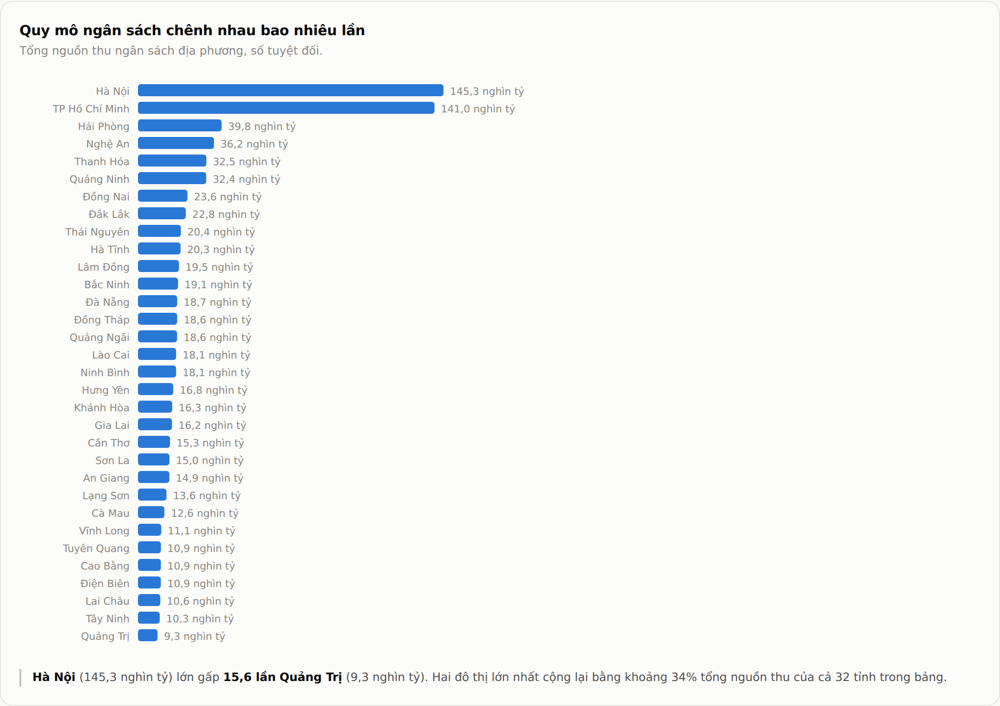
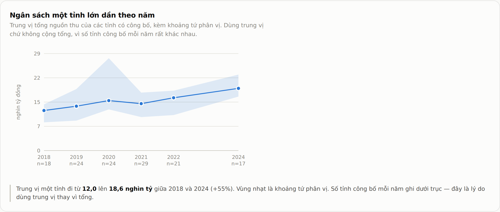
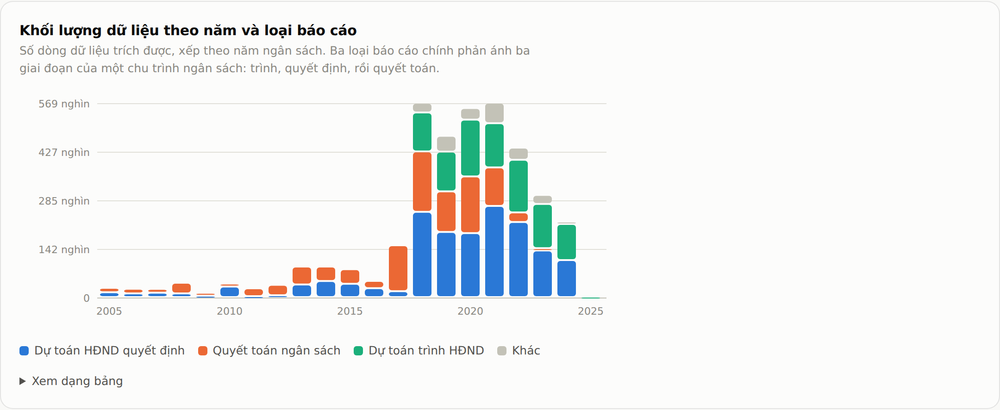
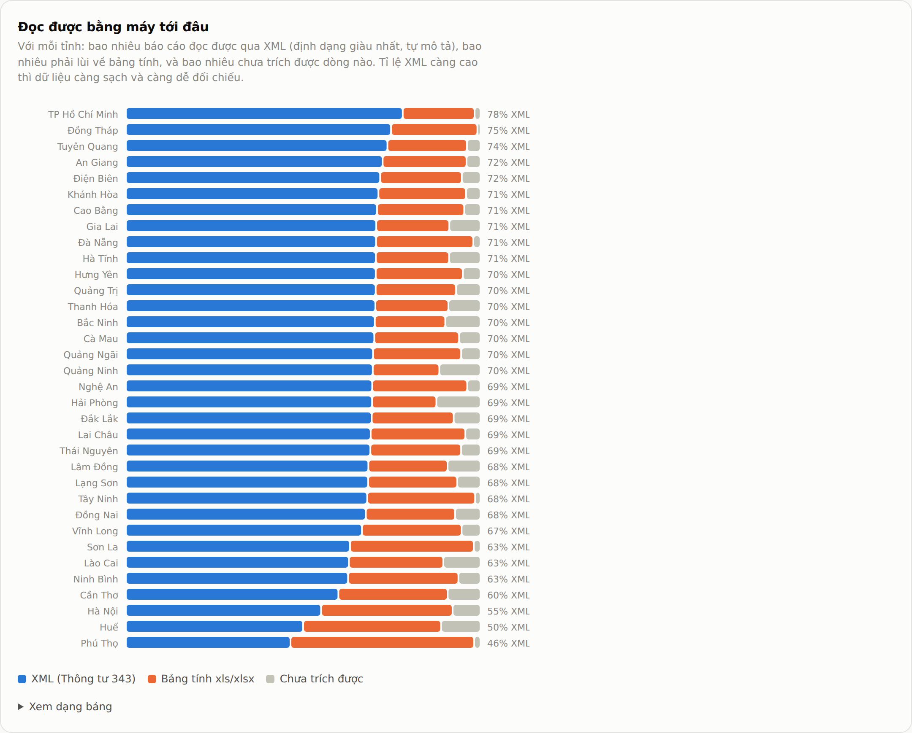
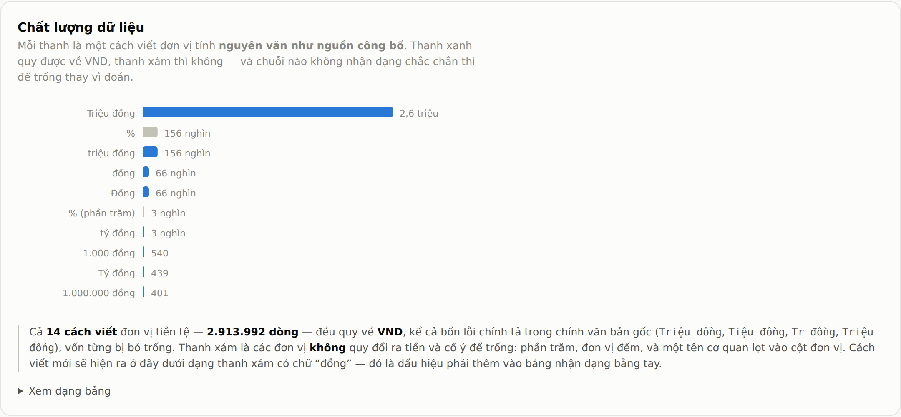

# dashboard/

A single self-contained page over the 3,814,427 rows the crawler produced.

Open `index.html` — no server, no build step, no network. Everything it needs, including
the numbers, is inside that one file.

<picture>
  <source media="(prefers-color-scheme: dark)" srcset="../docs/images/dashboard-hero-dark.png">
  
</picture>

The page follows the reader's theme; the screenshots below are the light one. Every figure on
it is computed from `data/nsnn.db` at build time — nothing on the page is estimated.

## Why it is built this way

The 34 workbooks are the deliverable but they are a terrible analysis surface: 250 MB of
xlsx, one file per province, no way to ask a question across them. So the pipeline gains
one more stage, and the dashboard reads the end of it rather than the workbooks.

```
work/<province>/     →  ETL  →  data/nsnn.db  →  aggregate  →  dashboard/data.json
cached sources          3.8M rows, 352 MB         GROUP BY          29 KB
                             ↕  db.py pack/restore                     ↓
                        data/nsnn.db.xz  33 MB, committed   build_html → index.html
```

**SQLite for the warehouse.** A single file, no server, and the whole corpus fits in one
`GROUP BY`. The fact table is fully normalised — 34 provinces share 21 periods, 6 scopes and
153,272 indicator labels across 3.8M rows, so every repeated string is interned into a
`dim_*` table and `fact_row` carries integer ids. Nothing is aggregated at load time:
`fact_row` is one row per source row, so any number on the page can be traced back through
`dim_report` to a stored file with a SHA-256.

**The database is not committed.** It is 360 MB and rebuilt in ~6 minutes from `work/`.
`data/` is gitignored; `dashboard/data.json` — the 29 KB of grouped answers the page
actually needs — is committed instead.

**The data is embedded, not fetched.** The page has to open from `file://`, from GitHub
Pages and inside a sandboxed frame. A `fetch()` fails in at least one of those, so
`build_html.py` inlines `data.json` into the HTML.

## Rebuild

```bash
.venv/bin/python dashboard/db.py restore  # nsnn.db.xz -> nsnn.db      (~13 s)  ← usually this
.venv/bin/python dashboard/etl.py         # work/ -> data/nsnn.db      (~6 min, needs work/)
.venv/bin/python dashboard/aggregate.py   # nsnn.db -> data.json       (~10 s)
.venv/bin/python dashboard/build_html.py  # data.json -> index.html    (instant)
.venv/bin/python dashboard/db.py pack     # nsnn.db -> nsnn.db.xz      (~93 s)
```

`etl.py` calls `pipeline/build.py` directly rather than reading the xlsx files, so the
warehouse always reflects the current parsers. It needs `work/` — the cached sources — so
after a fresh clone `db.py restore` is the route in, not `etl.py`.

`Quy đổi VND` is not a stored column: it is exactly `value * dim_unit.factor`, and `factor`
is `0` in precisely the cases where the parser leaves the conversion blank. The `v_fact`
view derives it, which keeps the rule in one place and takes 30 MB of duplicated floats out
of the file. The view reproduces all 1,993,578 converted values in the workbooks exactly.

Since the VND unification, `fact_row.value` already holds the VND figure and every currency
`factor` is `1`, so the multiplication is a no-op that keeps the shape. `dim_unit.label` still
holds the spelling the province published, exposed as `v_fact.unit_source`; `dim_unit.canon`
is the canonical one.

## Querying the warehouse

```sql
-- how much of each province's corpus carries a VND conversion
SELECT p.name, COUNT(*) AS rows,
       SUM(f.vnd IS NOT NULL) AS with_vnd
FROM fact_row f JOIN dim_province p ON p.id = f.province_id
GROUP BY p.name ORDER BY rows DESC;

-- one indicator across every province and year
SELECT p.name, pe.year, f.raw, u.label AS unit, f.vnd
FROM fact_row f
JOIN dim_province p  ON p.id = f.province_id
JOIN dim_period   pe ON pe.id = f.period_id
JOIN dim_indicator i ON i.id = f.indicator_id
JOIN dim_unit     u  ON u.id = f.unit_id
WHERE i.clean = 'TỔNG CHI NGÂN SÁCH ĐỊA PHƯƠNG'
ORDER BY p.name, pe.year;
```

`dim_indicator.clean` strips the outline marker that the source glues onto every label
(`"I Thu nội địa"` → `Thu nội địa`, depth 1), so indicators group across provinces that
number their rows differently. `dim_unit.factor` is the VND multiplier — `1` for every currency
spelling now that values are stored in VND, and `0` where the unit is unknown and the
conversion was deliberately left blank.

## What the page shows

**Ten analyses of the budget**, then four of the disclosure behind it. Every chart is below —
all fourteen, in page order, captured from the page itself.

### The budget

**1 — Self-sufficiency — B46.** Each province's revenue split into what it raises itself and what
the centre sends. Two published cells of one form, so there is nothing to double count.


**2 — Self-sufficiency against investment — B46.** r = 0.88 over 31 provinces: the self-funded ones
are the ones that build. The page says *tương quan, không phải nhân quả* on its own face.



**3 — Where the revenue comes from — B63, quyết toán.** The five largest domestic sources per province,
everything else as `khác`.


**4 — Land-sale dependence — B63.** Land-use revenue over total domestic revenue. Median 17%,
Thanh Hóa 41% at the top, TP Hồ Chí Minh 4% at the bottom — a one-off source that does not
repeat once the land bank is gone.


**5 — Recurrent spending by sector — B50.** Education 26% and health 24% at the median; science and
technology 1%. The legend says how many provinces were held back for a missing component.


**6 — Education against health — B50.** The two dominant lines side by side, per province — from
Tuyên Quang at 35%/24% to Lai Châu at 17%/35%.



**7 — Plan against outturn — B63.** Both columns come from the same report, so there is no
cross-form join. Revenue beats plan in 104 of 121 province-years (86%), median 106%.



**8 — Borrowing and repayment — B46.** Every province is low, because local borrowing is capped by
the Budget Law. Cần Thơ is the highest at 13% of total spending.



**9 — Absolute size — B46.** Hà Nội's 145.3 nghìn tỷ is 15.6x Quảng Trị's 9.3; the two largest
cities together are about 34% of all 32 provinces in the chart.



**10 — Trend — B46.** The median province, not a national sum, with the reporting count under each
year — which is the reason for using a median at all.



### The disclosure behind it

**11 — Who published what, and from when.** One cell per province-year, darker for more
reports; an empty cell means that province published nothing that year.


**12 — Volume by year and report type.** The three main types are the three stages of one
budget cycle: proposed, decided, then settled.



**13 — How machine-readable it is.** Per province: reports read through Circular 343 XML, those
that fell back to a spreadsheet, and those that yielded no rows at all. TP Hồ Chí Minh leads at
78% XML, Phú Thọ trails at 46%.



**14 — Data quality, read through the unit column.** Every published ĐVT spelling, verbatim.
Blue converts to VND, grey does not. All 14 currency spellings — 2,913,992 rows — now convert,
including the four misspellings in the source documents. A new spelling would appear here as a
grey bar containing `đồng`, which is the signal to add it by hand.



### The rule every one of these follows

Each figure is **a named cell of one named form**, and the derived numbers are ratios of two
such cells. Nothing is a sum of line items, so nothing can double count.

Two consequences are enforced in code rather than trusted:

- **Ambiguous cells are dropped, not guessed.** Where the header rebuild gave two different
  columns of a form the same series label, there is no way to know which column a value came
  from. Those keys are discarded and the count is printed by `aggregate.py` (B50 loses 289,
  B46 and B63 lose none). B65 loses ~120 of ~125 sector keys this way, which is why the
  sector split is read from B50 instead.
- **A province missing one charted component is excluded from that chart**, not drawn with a
  zero slice. Tây Ninh publishes 661.8 tỷ of education spending but its cell is ambiguous;
  drawn naively it became a province that spends nothing on schools. The legend says how many
  provinces were held back — visible under chart 5 above as *1 tỉnh không hiển thị vì thiếu ít
  nhất một lĩnh vực*.

### Why B46 and nothing wider

The corpus is long-format hierarchical line items. `TỔNG CHI NSĐP`, `B TỔNG CHI NSĐP` and
`A CHI CÂN ĐỐI NSĐP` all appear as separate rows of the same table, so summing line items
would double count.

B46 escapes that because every figure used is **a single published cell of one named form** —
never a sum. The ratio behind the headline is two such cells divided by each other, so there
is no summing assumption anywhere. Checked against the source: An Giang's 2019 own revenue
(5,243.9 tỷ) plus central transfers (8,230.2 tỷ) equals its published total (13,474.1 tỷ)
exactly, and its total spending equals its total revenue, as a budget plan must.

The figures are **dự toán** (plans), not **quyết toán** (settled accounts), and the latest
year with data differs by province (2020–2024) because disclosure coverage is uneven. Both
are stated on the page rather than smoothed over. 32 of 34 provinces carry B46 at all.

A national total across provinces is still not attempted: that needs a curated indicator
mapping per form, which does not exist yet. The trend chart shows the **median province**
rather than a sum for the same reason — the number of provinces reporting swings from 17 to
29 by year, so a sum would read as a collapse in a thin year.

The colour palette is validated, not eyeballed: three categorical slots and a six-step
sequential blue, checked in both modes with the data-viz validator (worst all-pairs CVD
ΔE 9.2 light / 9.4 dark). Every chart also has a table view, which is what carries the
light-mode aqua slot below the 3:1 contrast line.
